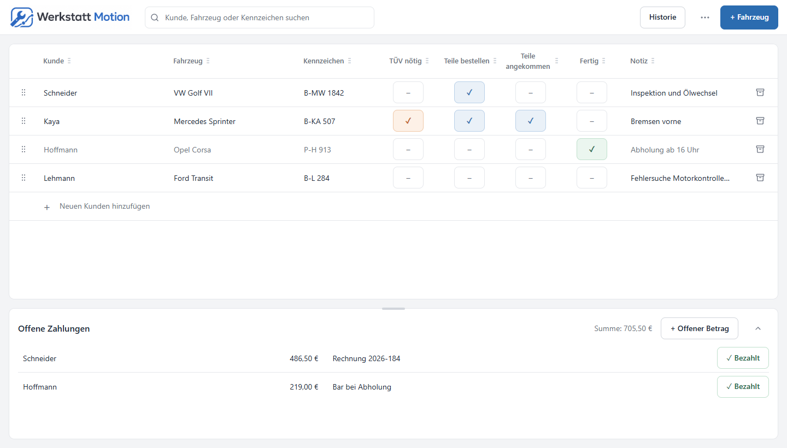

  

<strong>Alle Fahrzeuge, Arbeiten und offenen Zahlungen auf einen Blick.</strong>

Werkstatt Motion ist eine einfache Anwendung für den täglichen Werkstattbetrieb.
Keine verschachtelten Menüs, kein unnötiger Papierkram – einfach öffnen und loslegen.

## Das Wichtigste im Überblick

- Fahrzeuge und Kunden übersichtlich verwalten
- Arbeitsstand mit einem Klick markieren
- TÜV und bestellte Teile im Blick behalten
- Offene Zahlungen direkt sehen und als bezahlt markieren
- Fahrzeuge schnell nach Kunde, Kennzeichen oder Modell finden
- Erledigte Aufträge in der Historie nachschlagen
- Daten auf einem USB-Stick oder an einem anderen Ort sichern
- Funktioniert auch ohne Internet

## So einfach geht's

### Fahrzeug anlegen

Oben rechts auf **„+ Fahrzeug“** klicken und Kunde, Fahrzeug oder Kennzeichen
eintragen. Die Angaben werden automatisch gespeichert.

### Arbeitsstand ändern

Bei **„TÜV nötig“**, **„Teile bestellen“**, **„Teile angekommen“** oder
**„Fertig“** einfach auf das passende Feld klicken.

### Reihenfolge festlegen

Wichtige Fahrzeuge lassen sich am Griff links nach oben ziehen. So steht der
dringendste Auftrag immer ganz oben.

### Offene Zahlung eintragen

Im Bereich **„Offene Zahlungen“** auf **„+ Offener Betrag“** klicken. Sobald
bezahlt wurde, genügt ein Klick auf **„✓ Bezahlt“**.

### Fahrzeug suchen

Oben den Namen, das Kennzeichen oder das Fahrzeug eingeben. Die passende Zeile
erscheint sofort.

## Installation

1. Die Installationsdatei auf den Werkstatt-PC kopieren.
2. Die Datei doppelt anklicken und die Installation bestätigen.
3. **Werkstatt Motion** über das Startmenü öffnen.

Es werden keine zusätzlichen Programme und keine Anmeldung benötigt.

## Datensicherung

Über **„Backup“** lässt sich jederzeit eine Sicherung erstellen – zum Beispiel
auf einem USB-Stick. Mit **„Wiederherstellen“** kann eine Sicherung später
wieder eingespielt werden.

**Empfehlung:** Regelmäßig ein Backup erstellen und getrennt vom Werkstatt-PC
aufbewahren.

---

Werkstatt Motion wurde für den Werkstattalltag gemacht: schnell verständlich,
direkt bedienbar und ohne technisches Drumherum.
